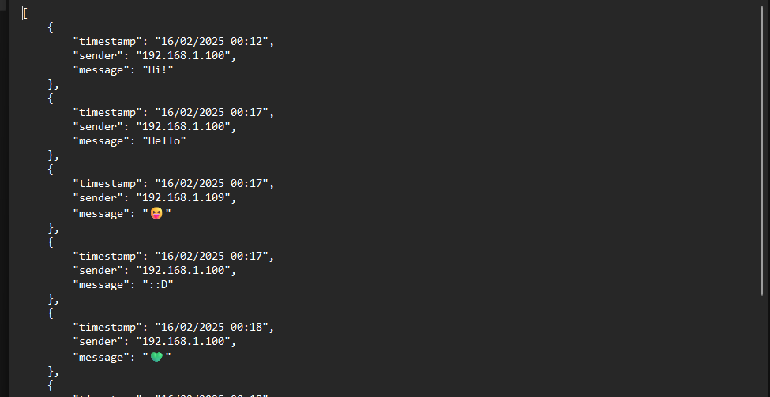
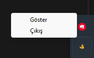

# 🦆 Message App

GIFs might take a bit to load, so grab a coffee, kick back, and get ready to witness the beauty unfold!

---

Hello! 👋 This app provides a **messaging platform** compatible with both phones and computers. Simple, fast, and secret! 🚀

## Language Options 🌍
- [Türkçe (Readme)](readme.tr.md)
- [English (Readme)](readme.md)

## 📌 Features
- **Save Your Messages 📂**
  - All messages are saved to the `C:\message_app\messages.json` file.
  - You can view or delete messages anytime.
  - 

- **Easy Access 🌐**
  - The **website opens automatically** when the app is launched.
  - You can access it from any device by entering the same address.
  
- **Hidden Icon Mode 🎭**
  - When `message_app.exe` is launched, the app is hidden to the system tray.
  - Right-click on the tray icon and select **"Exit"** to close the app.
  - 

- **Different Device Views 📱💻**
  - **Customized interface** for phones and computers.
  - Mobile-friendly design for easy use.

- **Night Mode 🌙**
  - A **dark theme** option that is gentle on the eyes.
  - You can adjust the appearance based on lighting conditions.

- **Additional Ease of Use ✨**
  - **Message Copying:** Double-click on a message to copy it to the clipboard. 🔷
  - **New Message Notification:** If you’ve scrolled to the top of the chat and a new message arrives, a "New message arrived" notification will pop up. Clicking on the notification will instantly take you to the bottom to see the message. 💚

---

## 🚀 How to Use

1. **Launch the App**
   - Run the `message_app.exe` file.
   - You’ll see the 🦆 icon in the system tray.
   - The website will open automatically!

2. **Start Messaging**
   - Log into the site and start chatting!
   - Your messages will be saved automatically.

3. **Log Out**
   - Right-click on the icon in the system tray and select "Exit."

---

## ⚙️ Technical Details
- **Main Files:**
  - `app.py` ➝ Runs the messaging site.
  - `message_app.py` ➝ Manages the system tray icon.

- **System Tray Function:**
  - Runs in the background without interrupting.
  - Can be easily managed by right-clicking.

---

## 📥 Download
You can download the app using the link below:  
[Download Message App](https://github.com/krstalacam/Duck-Message-App-/releases/download/v1.0.0/duck-message-app.exe)

---

That’s it! 🎉 You can now start messaging. Enjoy your chats! 💬✨