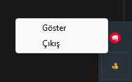

# 🦆 Message App

---

Merhaba! 👋 Bu uygulama, telefonlar ve bilgisayarlar için uyumlu bir **mesajlaşma platformu** sunar. Basit, hızlı ve gizli! 🚀

## Dil Seçenekleri 🌍
- [Türkçe (Readme)](readme.tr.md)
- [English (Readme)](readme.md)

## 📌 Özellikler
- **Mesajlarınızı Kaydedin 📂**
  - Tüm mesajlar `C:\message_app\messages.json` dosyasına kaydedilir.
  - Dilediğiniz zaman mesajları görüntüleyebilir veya silebilirsiniz.
  - 

- **Kolay Erişim 🌐**
  - Uygulama çalıştırıldığında **web sitesi otomatik açılır**.
  - Aynı adresi girerek herhangi bir cihazdan erişebilirsiniz.
  
- **Gizli Simge Modu 🎭**
  - `message_app.exe` çalıştırıldığında uygulama sistem tepsisine gizlenir.
  - Tepsi simgesine sağ tıklayıp **"Çıkış"** seçeneğiyle uygulamayı kapatabilirsiniz.
  - 

- **Farklı Cihaz Görünümleri 📱💻**
  - Telefon ve bilgisayarlar için **özelleştirilmiş arayüz**
  - Kullanım kolaylığı için mobil uyumlu tasarım

- **Gece Modu 🌙**
  - Göz yormayan **karanlık tema** seçeneği mevcut.
  - Işık koşullarına uygun olarak görünümü değiştirebilirsiniz.

- **Ekstra Kullanım Kolaylıkları ✨**
  - **Mesaj Kopyalama:** Bir mesajın üzerine iki kez tıkladığınızda, mesaj panoya kopyalanır.🔷
  - **Yeni Mesaj Bildirimi:** Eğer sohbetin üst kısımlarında kaldıysanız ve yeni mesaj geldiyse, "Yeni mesaj geldi" bildirimi çıkacaktır. Bildirime tıklarsanız, anında en alta giderek mesajı görebilirsiniz. 💚

---

## 🚀 Kullanım

1. **Uygulamayı Başlat**
   - `message_app.exe` dosyasını çalıştırın.
   - Sistem tepsisinde 🦆 ikonunu göreceksiniz.
   - Web sitesi otomatik açılacaktır!

2. **Mesajlaşmaya Başlayın**
   - Siteye giriş yapın ve mesajlaşmaya başlayın!
   - Mesajlarınız otomatik olarak kaydedilir.

3. **Çıkış Yapmak**
   - Sistem tepsisindeki ikona sağ tıklayın ve "Çıkış" seçeneğini seçin.

---

## ⚙️ Teknik Detaylar
- **Ana Dosyalar:**
  - `app.py` ➝ Mesajlaşma sitesini çalıştırır.
  - `message_app.py` ➝ Sistem tepsisi ikonunu yönetir.

- **Sistem Tepsisi İşlevi:**
  - Arka planda çalışarak rahatsız etmez.
  - Sağ tıklayıp kolayca yönetilebilir.

---

## 📥 İndirme
Uygulamayı indirmek için aşağıdaki bağlantıyı kullanabilirsiniz:  
[Message App İndir](https://github.com/krstalacam/Duck-Message-App-/releases/download/v1.0.0/duck-message-app.exe)

---

Bu kadar! 🎉 Artık mesajlaşmaya başlayabilirsiniz. Keyifli sohbetler! 💬✨
